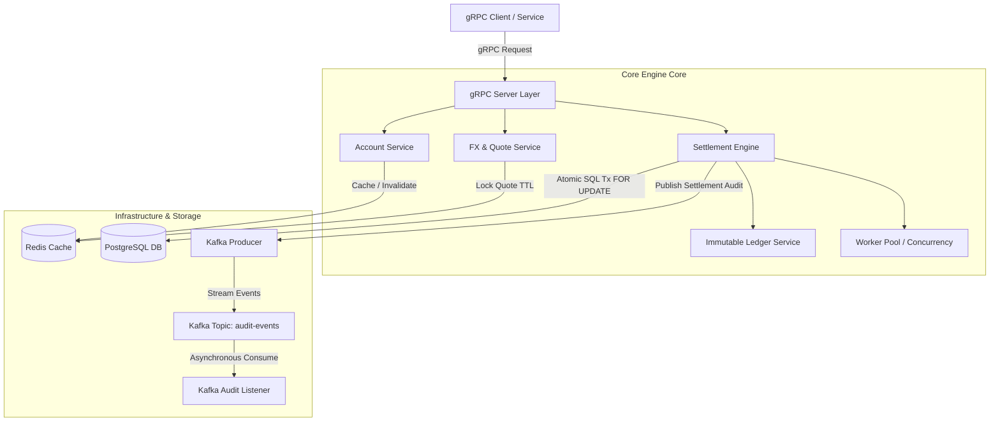

# Real-Time Cross-Border FX & Settlement Engine

[](https://golang.org)
[](https://grpc.io)
[](https://www.postgresql.org)
[](https://redis.io)
[](https://kafka.apache.org)
[](https://www.docker.com)

A production-style, high-concurrency cross-border payment settlement engine built in **Go**. The system processes multi-currency payment requests, locks FX rates with time-to-live (TTL) expiration, executes atomic double-entry balance debits/credits in PostgreSQL, maintains an immutable ledger, caches quotes/balances in Redis, and publishes asynchronous audit events via Kafka.

---

## 🏛 System Architecture



---

## ✨ Features

- **Multi-Currency Account Management**: Multi-currency account creation, balance updates, and lookup.
- **FX Quote Locking**: Real-time quote generation with configurable TTL (e.g. 60-second quote expiry) backed by Redis key expiration.
- **Atomic Double-Entry Settlement**: Thread-safe transaction processing in PostgreSQL using `SELECT ... FOR UPDATE` row locking to guarantee balance consistency and prevent double-spending.
- **Immutable Ledger**: Automated double-entry (Debit & Credit) ledger generation for audit trails.
- **Event-Driven Architecture**: Asynchronous audit and settlement event publishing via Kafka.
- **Concurrent Worker Pool**: Goroutine worker pool with context cancellation for high-throughput batch operations.
- **Dockerized Infrastructure**: Complete environment with PostgreSQL, Redis, Kafka, Zookeeper, and Go backend ready in one command.

---

## 🛠 Technology Stack

- **Backend**: Go 1.22
- **API Protocol**: gRPC & Protocol Buffers v3
- **Primary Database**: PostgreSQL 15
- **Caching Layer**: Redis 7
- **Event Streaming**: Apache Kafka
- **Containerization**: Docker & Docker Compose

---

## 🚀 Quick Start with Docker

### Prerequisites
- [Docker](https://docs.docker.com/get-docker/) & [Docker Compose](https://docs.docker.com/compose/install/)

### Run the System
Clone the repository and run:

```bash
docker-compose up --build
```

This starts:
- **PostgreSQL** at `localhost:5432` (Auto-runs migrations and seeds initial exchange rates)
- **Redis** at `localhost:6379`
- **Zookeeper & Kafka** at `localhost:9092`
- **FX Settlement Engine Service** at `0.0.0.0:50051`

---

## 📁 Repository Structure

```text
.
├── cmd/
│   └── server/
│       └── main.go                 # Application entrypoint
├── proto/
│   ├── settlement.proto            # Protobuf service definitions
│   └── gen/                        # Pre-generated gRPC Go stubs
├── internal/
│   ├── config/                     # Environment configuration loader
│   ├── domain/                     # Core domain models & interfaces
│   ├── repository/                 # PostgreSQL repository with SQL transactions
│   ├── cache/                      # Redis caching client
│   ├── account/                    # Account management service
│   ├── fx/                         # FX rate lookup and quote locking
│   ├── ledger/                     # Immutable double-entry ledger logic
│   ├── settlement/                 # Settlement engine core orchestrator
│   ├── kafka/                      # Kafka event producer and consumer
│   ├── worker/                     # Concurrency worker pool
│   └── grpc/                       # gRPC server interface implementations
├── migrations/
│   ├── 000001_init_schema.up.sql   # Database tables & exchange rate seed data
│   └── 000001_init_schema.down.sql # Rollback script
├── docker/
│   └── Dockerfile                  # Multi-stage container definition
├── docker-compose.yml              # Complete infrastructure setup
├── Makefile                        # Automation shortcuts
├── go.mod                          # Go dependency module
└── README.md                       # Project documentation
```

---

## 🧪 Testing

Run unit and integration tests:

```bash
go test -v ./...
```

---

## 🔌 gRPC API Endpoint Guide

The gRPC server runs reflection, allowing interaction via `grpcurl` or standard gRPC clients:

### 1. Create USD Sender Account
```bash
grpcurl -plaintext -d '{"owner_name": "Alice Corp", "currency": "USD", "initial_balance": 10000.0}' \
  localhost:50051 settlement.AccountService/CreateAccount
```

### 2. Create EUR Receiver Account
```bash
grpcurl -plaintext -d '{"owner_name": "Bob Enterprise", "currency": "EUR", "initial_balance": 500.0}' \
  localhost:50051 settlement.AccountService/CreateAccount
```

### 3. Lock FX Quote (USD -> EUR)
```bash
grpcurl -plaintext -d '{"from_currency": "USD", "to_currency": "EUR", "amount": 1000.0, "ttl_seconds": 60}' \
  localhost:50051 settlement.FXService/LockQuote
```

### 4. Execute Cross-Border Settlement
```bash
grpcurl -plaintext -d '{
  "sender_account_id": "<SENDER_ACCOUNT_ID>",
  "receiver_account_id": "<RECEIVER_ACCOUNT_ID>",
  "quote_id": "<QUOTE_ID>"
}' localhost:50051 settlement.SettlementService/CreateSettlement
```

---

## 📤 How to Push to GitHub as your Personal Repository

Follow these quick steps to push this project to your GitHub account:

### 1. Create a New GitHub Repository
1. Go to [GitHub - Create New Repository](https://github.com/new).
2. Name your repository (e.g. `fx-settlement-engine`).
3. Choose **Public** or **Private** and leave "Add a README" unchecked (since you already have one).
4. Click **Create repository**.

### 2. Initialize Git Locally and Push
Open your terminal in this project folder and run:

```bash
# Initialize git repository
git init

# Stage all files
git add .

# Create initial commit
git commit -m "feat: initial commit for Real-Time Cross-Border FX & Settlement Engine"

# Rename branch to main
git branch -M main

# Add your GitHub repository remote (replace YOUR_USERNAME with your GitHub username)
git remote add origin https://github.com/YOUR_USERNAME/fx-settlement-engine.git

# Push code to GitHub
git push -u origin main
```

---

## 📄 License
This project is open-source and available under the [MIT License](LICENSE).
